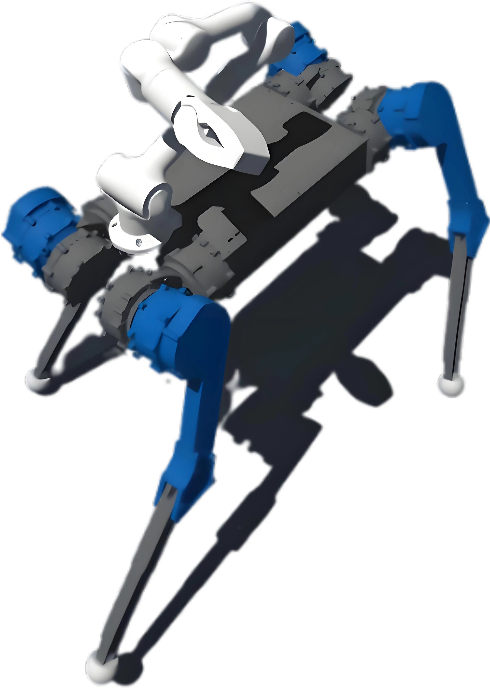
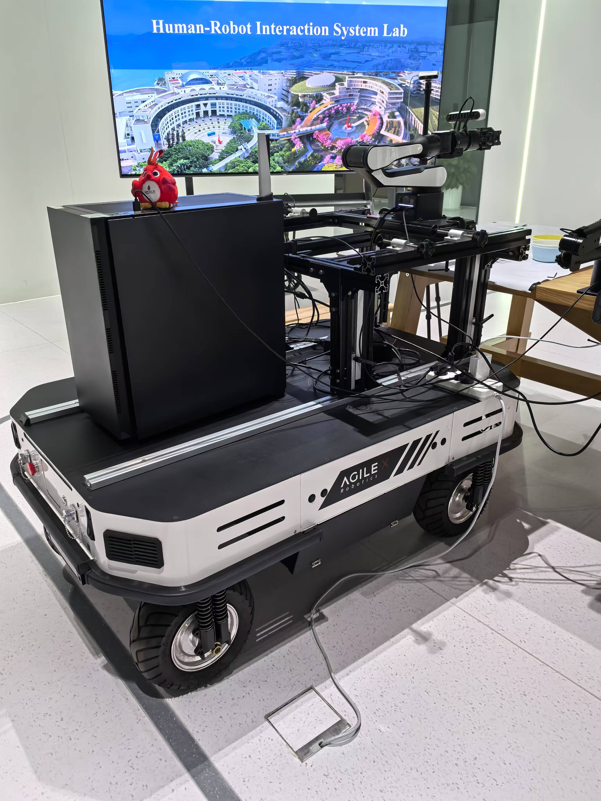

<h2 align="center"> Multifunctional-Mobile-Platform

<h5 align="center"> HKUST(GZ) Group 48 RBM Project

## 📣 News
* **[2024/5/17]** 🚀 Good news for winning the 3rd prize at AXS Sim2Real Challenge (Simulation Stage)!
* **[2024/5/17]** 🚀 Good news for winning the 2nd prize at AXS Sim2Real Challenge (Onsite) held during ICRA 2024, Yokohama!
* **[2024/12/12]** ⭐️ We will be having roadshow on Dec. 12th! Welcome to HKUST(GZ) E2 6F Human-Robot Interaction System Lab for a visit!

## 🕹️ Prototype

Check here for our 2nd Gen Prototype!
